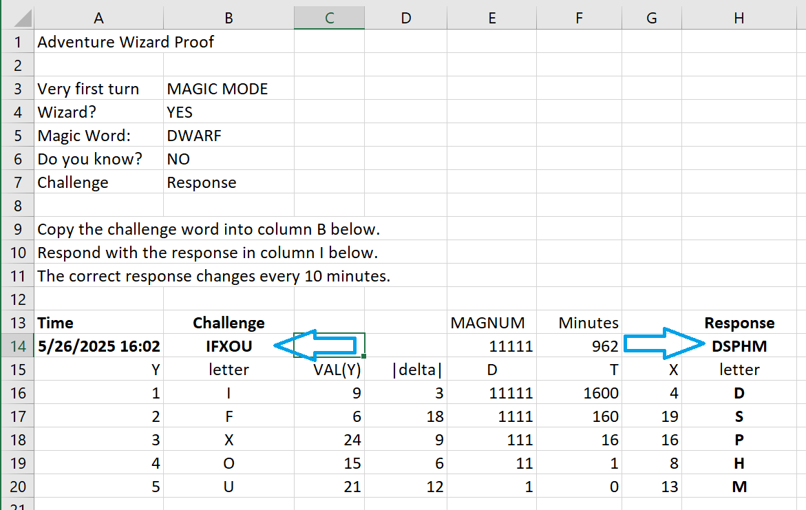

# An Adventure in Fortran

This project is a translator that rewrites code written in a subset of Fortran IV (from the DEC PDP-10 era) into a portable C program in order to recreate the authentic experience of [Adventure](https://en.wikipedia.org/wiki/Colossal_Cave_Adventure) as played in the late 1970s.

The goal was to implement just enough of Fortran IV (and the DEC PDP-10 runtime environment) to be able to translate Adventure without making any changes to the source file(s).  Adventure uses only a fraction of the features of Fortran, which reduced much of the challenge.

## Status

Using [The Adventure Family Tree](https://mipmip.org/advfamily/advfamily.html)'s nomenclature for identifying versions of Adventure ...

| Version | Translates | Compiles | Executes | Saves State |
|:--------|:-----------|:---------|:---------|:------------|
|[WOOD0350 Ver. 2](https://mipmip.org/advfamily/advfamily.html#WOOD0350)| YES | YES<sup>_a, b_</sup>| YES | not yet<sup>_f_</sup> |
|[WOOD0350 Ver. 1](https://mipmip.org/advfamily/advfamily.html#WOOD0350)| YES<sup>_c, d_</sup> | YES<sup>_a, b_</sup> | YES<sup>_e_</sup> | not yet<sup>_f_</sup> |
|[CROW0000_f4_1977-03-31](https://mipmip.org/advfamily/advfamily.html#CROW0000)| not yet<sup>_g_</sup> | -- | -- | -- |

* <sup>_a_</sup> The compiler warns about two variables that are declared but unused.  These can be ignored.  The problem is understood but not currently a high priority.
* <sup>_b_</sup> The optimizer (which does more flow analysis) warns of a few instances of unreachable code.  Some subroutines do not return (by design), but the translator doesn't realize that.  The calls sites are bookended by code to ensure the temporary variable stack remains balanced, resulting in unreachable code.  These can be safely ignored.  The problem is understood but not currently a high priority.
* <sup>_c_</sup> The translator warns about a type specification statement used later than it should be.  This is technically a bug in the Fortran source, but it's harmless in this case.
* <sup>_d_</sup> The tools\test.bat file does not properly handle the fact that this version is split into multiple source files, so you have to invoke the translator manually with both source files in the same command.
* <sup>_e_</sup> The game expects its data file to be named `TEXT` (no directory path, no extension).  Launch the program with the command line option `-fTEXT=<path>` where `<path>` is the path to the actual data file.
* <sup>_f_</sup> I'm working on a plan to enable this.
* <sup>_g_</sup> This version uses a floating point random number generator, so I'm going to have to add some support for REAL variables and constants.

## How to Try It Out

I recognize this looks a bit cumbersome.  I have plans to streamline this.

### 1. Clone the repository

```
git clone https://github.com/aidtopia/fortran-adventure.git
cd fortran-adventure
```

### 2. Build the translator

Choose your own path: [Windows with Visual Studio](#windows-with-visual-studio) or [Another system](#another-system).

#### Windows with Visual Studio

Start a [VS Developer Command Prompt](https://learn.microsoft.com/en-us/visualstudio/ide/reference/command-prompt-powershell?view=vs-2022).  A Developer Command Prompt is just a regular command prompt with PATH and other environment environment variables set to access the compilers and tools that come with Visual Studio.

You can build the translator using the IDE...

```
start fortran\fortran.sln
```

**or** you can use MSBUILD like this:

```
msbuild fortran\fortran.sln -p:Configuration=Release
```

#### Another system

If you use another toolchain, like clang or gcc, you'll have to cobble together a script or makefile to compile and link all of the C++ files in the `fortran` subdirectory.

**NOTE:**  The translator uses some features from C++23.  For gcc and clang, make sure you're using a fairly recent version and specify `-std:c++23` among the options on the compiler command line.

### 3. Get the Adventure code

I haven't included Adventure sources in this repository, so you'll have to download them.  I suggest starting with the aforementioned [Adventure Family Tree](https://mipmip.org/advfamily/advfamily.html) and using its links to the [Interactive Fiction Database](https://ifdb.org/).

The example below downloads the WOOD0350v2 version, which is a good one to start with.

```
curl -so advent-original.tar.gz http://ifarchive.org/if-archive/games/source/advent-original.tar.gz
```

That file is an archive that bundles together a few files; we need to extract them:

```
tar -xf advent-original.tar.gz
```

The extracted files are placed in a subdirectory called `advent`, which contains the source and data file.  I suggest renaming the directory.

```
rename advent WOOD0350v2
```

### 4. Run the translator

In the directory with the Adventure sources, run the translator (`fortran`), and the name(s) of the source file(s).

```
cd WOOD0350v2
..\fortran\x64\Release\fortran.exe advent.for
```

### 5. Compile the translated program

The translator should have created a subdirectory called `target`, which will contain the C source file and a dump of the symbol table.

Compile the C code with your favorite compiler.  The example below uses `cl` (which is the MS Visual C compiler includes in Visual Studio).  The generated C code should be compliant with the C11 standard and thus very portable.  Any competent C compiler should do.

```
cd target
cl /nologo /std:c11 /W4 /Od /ZI ADVENT.c
```

### 6. Run Adventure!

Make sure Adventure's data file is in the current directory, and start the program you just built.

```
cd ..
target\ADVENT.exe
```

### 7. Provide a data file mapping

If you've followed this example, the program should begin and you can skip to [step 8](#8-go-already).

If, however, you're working with a different version of Adventure, the program might say it was unable to open the data file and then exit.  For example, if you were using WOOD0350v**1**, you'd see:

```
INITIALISING...
The program failed to open a file named "TEXT".
You can restart the program with a file name mapping using the
command line option -f, like this:

    -fTEXT=<path>
```

In this case, you'd run it again like this:

```
target\ADVEN.exe -fTEXT=adven.dat
```

### 8. Go already!

You should see messages about initialization and loading the data file, followed by `INIT DONE`.

```
INITIALIZING...
TABLE SPACE USED:
  9616 OF   9650 WORDS OF MESSAGES
   742 OF    750 TRAVEL OPTIONS
   296 OF    300 VOCABULARY WORDS
   140 OF    150 LOCATIONS
    53 OF    100 OBJECTS
    31 OF     35 ACTION VERBS
   201 OF    205 RTEXT MESSAGES
    10 OF     12 CLASS MESSAGES
     9 OF     20 HINTS
    32 OF     35 MAGIC MESSAGES


INIT DONE
```

At this point, the program is paused, for reasons that made sense when you were using a PDP-10 in the 1970s.  Type `G` (for go) or `X` (for exit) and press return (a.k.a., enter).

```
G
```

### 9. Prove you're a wizard ... or not

If you start Adventure during business hours, you may be told that the cave is closed.

```
I'M TERRIBLY SORRY, BUT COLOSSAL CAVE IS CLOSED.  OUR HOURS ARE:

         MON - FRI:   0:00 TO  8:00
                     18:00 TO 24:00
         SAT - SUN:  OPEN ALL DAY
         HOLIDAYS:   OPEN ALL DAY
```

You can bypass this by telling Adventure that [you're a wizard](#wizard-option).  But you'll be challenged to prove it.

Novice adventurers may prefer the [time travel option](#time-travel-option).

#### Wizard Option

The wizard.xlsx Excel spreadsheet in the `tools` directory has a synopsis of the answers you must give and it will compute the necessary response to the final challenge.

In the following examples, the user's responses are in lowercase.

```
ONLY WIZARDS ARE PERMITTED WITHIN THE CAVE RIGHT NOW.

ARE YOU A WIZARD?

yes

PROVE IT!  SAY THE MAGIC WORD!

dwarf

THAT IS NOT WHAT I THOUGHT IT WAS.  DO YOU KNOW WHAT I THOUGHT IT WAS?

no

IFXOU
```

In the above example, the `IFXOU` is a randomly selected challenge word.  The user must apply an algorithm to the challenge word to generate the correct response word.  The spreadsheet does the work for you.



```
dsphm

OH DEAR, YOU REALLY *ARE* A WIZARD!  SORRY TO HAVE BOTHERED YOU . . .
```

#### Time Travel Option

The translator added some command line options to the program that can be used to work around compatibility problems and a Y2K bug.  These options can be used to override the date and time that Adventure sees when it asks for the system time.  I suggest setting the date to midnight, January 1, 1977, like this:

```
target\ADVENT.exe -t0:00 -d1-JAN-1977
```

There are several advantages to this approach:

* The cave will be open (because it's midnight on a Sunday).
* It avoids Y2K bugs.
* It simplifies the wizard challenge if you choose to try out the administrator options.
* It seeds the random number generator consistently.

### 10. Welcome to Adventure!!

Be aware that it is not yet possible to save your game state.  I'm working on that.  In the meantime, don't blame me if a dwarf knifes you.

```
WELCOME TO ADVENTURE!!  WOULD YOU LIKE INSTRUCTIONS?

no

YOU ARE STANDING AT THE END OF A ROAD BEFORE A SMALL BRICK BUILDING.
AROUND YOU IS A FOREST.  A SMALL STREAM FLOWS OUT OF THE BUILDING AND
DOWN A GULLY.

enter building

YOU ARE INSIDE A BUILDING, A WELL HOUSE FOR A LARGE SPRING.
```

## Motivation

As far as I can tell, the version of Adventure I played in the late 1970s has never been ported to a modern system with 100% fidelity. (See Note 1.)

Many ports have been based on extended versions (more rooms, puzzles, and treasures).  Many have modernized aspects of the experience, like replacing the ALL CAPS text with mixed case, adding a status bar, etc.  Most have made simplifying changes, like the elimination of wizard mode.

I don't really mind some changes, like mixed-case text.  Then again, a status bar changes the feel of the game more than I would have expected.  And I wanted to once again experience the challenge of proving I'm a wizard in order to play when the cave is closed.

Even the best ports have introduced subtle differences and sometimes even bugs.  So any visible change is&mdash;to me&mdash;a red flag.

My particular pet peeves are omissions or bugs that break some of the methods of navigating the world.  There were various ways to navigate in portions, both above ground and below.  But all anyone remembers is that you had to use compass directions.  Part of the problem is that the other forms of travel were often broken in the ports.  Subsequent text adventure games and works of interactive fiction, regardless of genre, solidified the compass as the one true way to navigate, and that has always disappointed me.  It's difficult to demonstrate the alternatives in the game that started the category because it's one of the most common ways the ports behave differently than the original.

Why aren't there ports based on the original, canonical source?

Those who have wanted to port the game have been warned away from using the early versions of the source because it makes "extensive" use of peculiar features of DEC Fortran IV on the PDP-10.

I would not be turned away.

I wanted to play the game as it was when I first played it.

So rather than attempt yet another port (and thus inject my own bugs), I set out to write <strike>an interpreter</strike> _a translator_ for the minimal subset of Fortran IV necessary to run the Adventure from the original unaltered source code and data file. (See Note 2.)

And that means I had to face with hazards of the aforementioned peculiar features.

So let's [dive in](docs/peculiar.md).

---

**Notes**

1. As I've worked on this project, I've learned that some ports have been updated, fixing at least some of the telltale bugs I'm used to spotting.  So it's possible that there may be one out there that is a faithful port.  At this point, I don't care.  I'm having fun.

2. A couple weeks into this project, I came across a [project](https://github.com/swenson/adventwure/tree/main) that uses a PDP-10 Fortran IV interpreter written in Python.  Its existence was part of the impetus to switch my projects from interpreter to translator.
